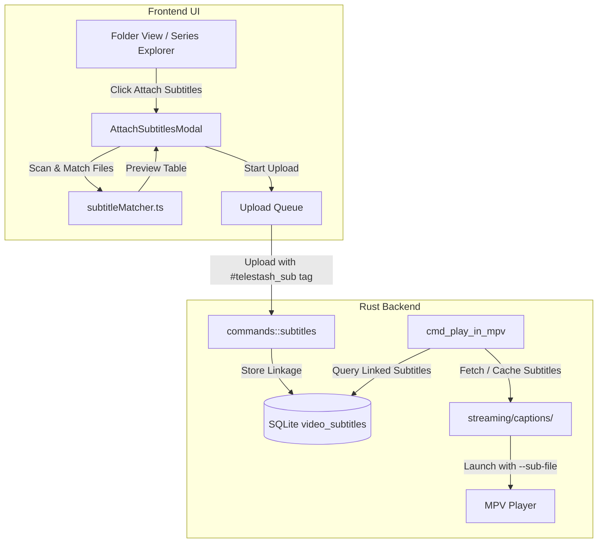

# External Subtitles Sidecar & Smart Linkage Implementation Plan

> **For agentic workers:** REQUIRED SUB-SKILL: Use superpowers:subagent-driven-development to implement this plan task-by-task. Steps use checkbox (`- [ ]`) syntax for tracking.

**Goal:** Allow users to bulk upload MKV/video files directly and attach external subtitle files/folders (`.sub`+`.idx` VobSub, `.srt`, `.ass`, `.vtt`) at any time, maintaining a 100% clean series list in TeleStash while enabling automatic subtitle playback in MPV.

**Architecture:** A smart subtitle matcher pairs local subtitle files (`sub/` directory or file picker) with existing Telegram video messages in the active folder. Subtitle files are uploaded with a hidden `#telestash_sub` caption tag, recorded in a `video_subtitles` SQLite table, and filtered from the regular file list. During MPV playback, TeleStash downloads/caches the subtitle tracks and passes them as `--sub-file` arguments.

**Architecture Diagram:**



**Tech Stack:** React 19, TypeScript, Tailwind CSS, Lucide React, Tauri 2.x (Rust), SQLite (WAL mode), MPV sidecar.

## Global Constraints
- Do not modify original local video or subtitle files on disk.
- Zero clutter: Filter out `#telestash_sub` messages from default file list.
- Support VobSub (`.idx` + `.sub` pair), `.srt`, `.ass`, `.ssa`, and `.vtt`.
- 100% pass on all existing tests (`test:versions`, `test:series-parser`, `test:updater-signing-key`).

---

### Task 1: Subtitle Matching Engine & Unit Tests

**Files:**
- Create: `app/src/utils/subtitleMatcher.ts`
- Create: `app/scripts/subtitle-matcher.test.js`
- Modify: `app/package.json`

**Interfaces:**
- Produces:
  ```typescript
  export interface SubtitleMatchResult {
    videoFile: TelegramFile;
    matchedSubtitles: {
      path: string;
      name: string;
      format: 'vobsub_idx' | 'vobsub_sub' | 'srt' | 'ass' | 'ssa' | 'vtt';
      language: string;
      pairedVobSubPath?: string;
    }[];
  }
  export function matchSubtitlesToVideos(
    videos: TelegramFile[],
    subtitlePaths: string[]
  ): SubtitleMatchResult[];
  ```

- [ ] **Step 1: Write failing unit test `subtitle-matcher.test.js`**
- [ ] **Step 2: Run `node --test scripts/subtitle-matcher.test.js` to verify failure**
- [ ] **Step 3: Implement `subtitleMatcher.ts`**
- [ ] **Step 4: Run `node --test scripts/subtitle-matcher.test.js` to verify pass**
- [ ] **Step 5: Add `"test:subtitle-matcher"` to `app/package.json` and commit**

---

### Task 2: SQLite Schema Migration & Backend Subtitles Module

**Files:**
- Modify: `app/src-tauri/src/db.rs`
- Create: `app/src-tauri/src/commands/subtitles.rs`
- Modify: `app/src-tauri/src/commands/mod.rs`
- Modify: `app/src-tauri/src/lib.rs`

**Interfaces:**
- Produces Tauri commands:
  - `cmd_get_video_subtitles(folder_id: i64, message_id: i64)`
  - `cmd_attach_video_subtitles(folder_id: i64, video_msg_id: i64, subtitle_paths: Vec<String>, lang: String)`
  - `cmd_delete_video_subtitle(subtitle_id: String)`

- [ ] **Step 1: Add `video_subtitles` table creation in `app/src-tauri/src/db.rs`**
- [ ] **Step 2: Create `commands/subtitles.rs` with database operations and Telegram caption sidecar parser**
- [ ] **Step 3: Register commands in `commands/mod.rs` and `lib.rs`**
- [ ] **Step 4: Verify with `cargo check --locked` in `app/src-tauri`**
- [ ] **Step 5: Commit changes**

---

### Task 3: MPV Subtitle Playback Integration

**Files:**
- Modify: `app/src-tauri/src/commands/streaming.rs`

**Interfaces:**
- Consumes: `video_subtitles` table records from Task 2.
- Produces: Automatic `--sub-file` arguments passed into MPV execution.

- [ ] **Step 1: Update `cmd_play_in_mpv` to query `video_subtitles` for the active `(folder_id, message_id)`**
- [ ] **Step 2: Download/cache any missing attached subtitle files from Telegram to `app_data_dir/streaming/captions/`**
- [ ] **Step 3: Append `--sub-file` for `.idx` or `.srt` or `.ass` to MPV launch arguments**
- [ ] **Step 4: Verify with `cargo check --locked`**
- [ ] **Step 5: Commit changes**

---

### Task 4: Frontend "Attach Subtitles" Modal & UI Badges

**Files:**
- Create: `app/src/components/desktop/dashboard/AttachSubtitlesModal.tsx`
- Modify: `app/src/components/desktop/dashboard/FileExplorer.tsx`
- Modify: `app/src/components/desktop/dashboard/FileList.tsx`

**Interfaces:**
- Consumes: `matchSubtitlesToVideos` from Task 1, `cmd_attach_video_subtitles` from Task 2.

- [ ] **Step 1: Create `AttachSubtitlesModal.tsx` with folder/file picker, matched preview table, and language tags**
- [ ] **Step 2: Add "Attach Subtitles" button to toolbar & context menu in `FileExplorer.tsx`**
- [ ] **Step 3: Add `[CC]` / `[Sub]` badge indicator on video items in `FileList.tsx`**
- [ ] **Step 4: Filter out `#telestash_sub` messages from the general file list**
- [ ] **Step 5: Run `npm run build` to verify clean frontend bundle**
- [ ] **Step 6: Commit changes**

---

### Task 5: End-to-End Verification & Documentation

**Files:**
- Modify: `CHANGELOG.md`
- Run: Complete test suite

- [ ] **Step 1: Run all test scripts (`npm run test:versions`, `npm run test:series-parser`, `npm run test:subtitle-matcher`, `npm run test:updater-signing-key`)**
- [ ] **Step 2: Update `CHANGELOG.md` with Unreleased / Subtitle Sidecar notes**
- [ ] **Step 3: Commit and verify git status**
